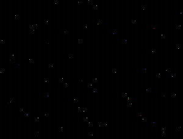

## A New Screen Saver Lookalike\!\!\!

### Description

Learn how to make ur own screen saver lookalike with this simple code!!!!

please comment and vote!!!
 
### More Info
 
i didnt make it FrmOnTop cause i dont see a need in it... u might...

             |
---                |---
**Submitted On**   |2000-06-04 00:31:14
**By**             |[AdamSpicer](https://github.com/Planet-Source-Code/PSCIndex/blob/master/ByAuthor/adamspicer.md)
**Level**          |Intermediate
**User Rating**    |5.0 (15 globes from 3 users)
**Compatibility**  |VB 5\.0, VB 6\.0
**Category**       |[Custom Controls/ Forms/  Menus](https://github.com/Planet-Source-Code/PSCIndex/blob/master/ByCategory/custom-controls-forms-menus__1-4.md)
**World**          |[Visual Basic](https://github.com/Planet-Source-Code/PSCIndex/blob/master/ByWorld/visual-basic.md)
**Archive File**   |[CODE\_UPLOAD6412642000\.zip](https://github.com/Planet-Source-Code/adamspicer-a-new-screen-saver-lookalike__1-8615/archive/master.zip)

